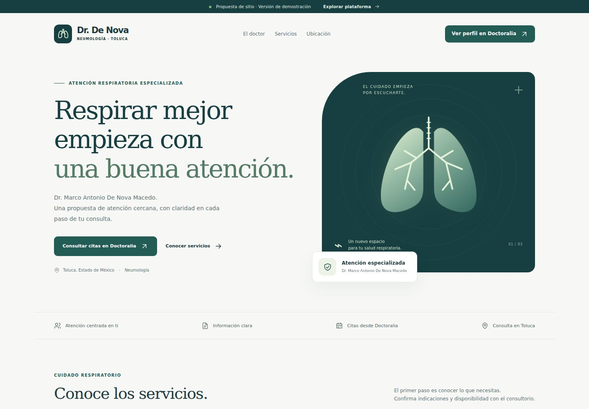

# PulmonogyClinic

Proyecto digital del Dr. Marco Antonio De Nova Macedo: sitio profesional propuesto y plataforma de demostración para consultorio, farmacia y caja.

**Estado: v0.5.0 — sitio/demo públicos + portal privado local conectado a inventario y compras. Todos los pacientes, proveedores, compras, notas, productos, lotes, equipos y cobros son ficticios. No usar para atención clínica ni capturar datos reales.**

[Abrir sitio y demo publicados](https://finithe-phoenix.github.io/PulmonogyClinic/) · [Iniciar portal privado local](docs/PRIVATE_PORTAL.md) · [Diagnóstico y pendientes por dependencia](docs/SESSION_2026-09-28.md)

La v0.5.0 completa el recorrido local **inicio de sesión → proveedor → orden → recepción parcial → existencias → auditoría** con Keycloak/PKCE, roles de servidor y PostgreSQL. El portal se compila por separado y no se publica en Pages. Requiere Node 24 y Docker: `npm ci`, `npm run build:portal`, `npm run dev:private`, `node scripts/wait-private.mjs`; abrir `http://localhost:4180/`. Las contraseñas sintéticas se generan en `.local/private.env`, excluido del repositorio. [Guía y límites](docs/PRIVATE_PORTAL.md).



[Sitio completo](docs/previews/sitio-completo.png) · [Sitio en celular](docs/previews/sitio-mobile.jpg) · [Inventario en escritorio](docs/previews/inventario-desktop.png) · [Inventario en celular](docs/previews/inventario-mobile.png) · [Ver el panel de gestión](docs/previews/panel-desktop.png) · [Compras en escritorio](docs/previews/compras-desktop.png) · [Compras en celular](docs/previews/compras-mobile.png) · [Guion para presentar la demo](docs/DEMO_GUIDE.md) · [Validaciones y límites](docs/VALIDATION.md)

## Ejecutar

Node.js 24 (>=24.15), npm y Git.

```bash
npm ci
npm start
```

Abrir la dirección que indique Angular. Para compilar como proyecto de GitHub Pages:

```bash
npm test
npm run build:pages
```

Para comprobar los flujos en navegador, instalar Chromium de Playwright una vez y ejecutar:

```bash
npx playwright install chromium
npm run check
```

`check` ejecuta reglas de dominio, compilación de producción y pruebas de navegación, agenda, inventario, notas y caja en escritorio y pantalla móvil. La emulación móvil usa Chromium; no sustituye una prueba en Safari/iPhone real. Para revisar el resultado compilado localmente: `npm run preview` y abrir `http://127.0.0.1:4173/PulmonogyClinic/`.

Si el navegador bloquea el almacenamiento, la interfaz muestra un aviso permanente de modo temporal: los cambios de esa sesión se pierden al recargar.

Salida: `dist/clinic/browser`. Base pública: `/PulmonogyClinic/`. La navegación de los módulos usa fragmentos `#/panel/...` para soportar recarga y enlaces directos en GitHub Pages.

## Qué se puede probar

| Área            | Disponible en esta demo                                                                                                 |
| --------------- | ----------------------------------------------------------------------------------------------------------------------- |
| Sitio propuesto | Diseño adaptable, cuatro servicios, guía de visita, seis preguntas frecuentes, ubicación y contacto en Doctoralia.                  |
| Resumen         | Indicadores derivados de los ejemplos, jornada, alertas y accesos rápidos.                                              |
| Recepción       | Filtrar citas, simular una cita, impedir un horario duplicado, llegada, inicio, finalización y cancelación.             |
| Pacientes       | Buscar perfiles ficticios y agregar ejemplos con identificador propio.                                                  |
| Consultas       | Seleccionar paciente, crear notas, guardar borradores, cerrar ejemplos, agregar adendas y exportar JSON.                |
| Inventario      | Dar de alta productos y lotes, buscar, registrar entradas/salidas, bloquear caducados/cuarentena/faltantes, FEFO y CSV. |
| Compras         | Proveedores ficticios, órdenes de varias partidas, recepción parcial por lote, cuarentena, cancelación del saldo y CSV. |
| Equipos         | Activos ilustrativos y cambio de disponibilidad/mantenimiento.                                                          |
| Caja            | Cobros simulados en centavos, referencia única, reversos con motivo, conciliación de efectivo y CSV.                    |
| Proyecto        | Estado visible de lo demostrado y lo pendiente para producción.                                                         |

Los cambios de la demo se conservan en `localStorage` de ese navegador. **La interfaz pública no está conectada a la API privada. En la demo no hay sincronización entre dispositivos, reservas en Doctoralia, firma electrónica, recetas válidas, pagos, CFDI ni certificación clínica.** El cierre de una nota es una demostración visual y lógica, no una firma médica. Los bloqueos de la demo son locales. El módulo `backend` implementa transacciones PostgreSQL, permisos por JWT, lotes, movimientos, cuarentena e idempotencia. El portal privado local de v0.5.0 consume esa API con Keycloak de desarrollo; identidad/MFA y despliegue productivos permanecen pendientes. Ver [API privada y puesta en marcha](backend/README.md).

La v0.4.0 agrega al servidor **proveedores, órdenes de varias partidas y recepciones parciales**. Crear una orden no cambia el stock. Confirmar una entrega guarda lote, entrada, costo de la partida, saldo recibido y auditoría en una sola transacción; una cancelación administrativa conserva lo recibido y cierra únicamente lo pendiente. Incluye migración desde la v0.3.0 y pruebas de reintentos, permisos y concurrencia. [Contrato de compras](backend/docs/PURCHASING_API.md).

**Validación local:** 96 casos aprobados: 25 de reglas, 22 de demo en navegador, 39 del servidor con PostgreSQL (incluida la migración) y 10 del portal con identidad real de desarrollo. [Ejecuciones y límites](docs/VALIDATION.md).

Fecha operativa fija: **28 de septiembre de 2026**, señalada en la interfaz para que los casos de caducidad y conciliación sean reproducibles. Precios y equipos son ejemplos, no información comercial validada.

## Publicación en GitHub Pages

El workflow `.github/workflows/api.yml` valida la API en PostgreSQL 17 con tokens firmados de prueba. El workflow `.github/workflows/pages.yml` ejecuta pruebas, compila y publica únicamente el resultado estático. En pull requests solo valida.

Pages fue habilitado con Source **GitHub Actions** el 28/09/2026; la publicación y su URL fueron verificadas. En una copia nueva del repositorio se debe habilitar esa opción una vez. No se incluye ningún token personal en el repositorio. Ver [guía de publicación](docs/DEPLOYMENT.md).

## Organización

```text
backend/       API Java 21 + Spring Boot, PostgreSQL, migraciones y pruebas HTTP
src/app/       Interfaz Angular, datos sintéticos y reglas de la demo
tests/         Pruebas de reglas de inventario, agenda, notas, caja y exportación
docs/          Alcance, arquitectura, ruta a producción y validaciones
.github/       Construcción, pruebas, publicación y actualización de dependencias
```

Angular **21.2.24 LTS**, TypeScript **5.9.3**, Node **24**. Dependencias fijadas y lockfile versionado. Ver [arquitectura](docs/ARCHITECTURE.md), [backlog](docs/BACKLOG.md), [guion de demo](docs/DEMO_GUIDE.md) y [fuentes de contenido](docs/CONTENT_SOURCES.md).

La marca visual es provisional. Antes de convertir esta propuesta en sitio oficial, el titular debe validar identidad, contenidos, ubicación vigente, servicios, avisos y publicidad aplicable. El sitio de revisión incluye `noindex` y `robots.txt`; esto **no** limita su acceso público.
